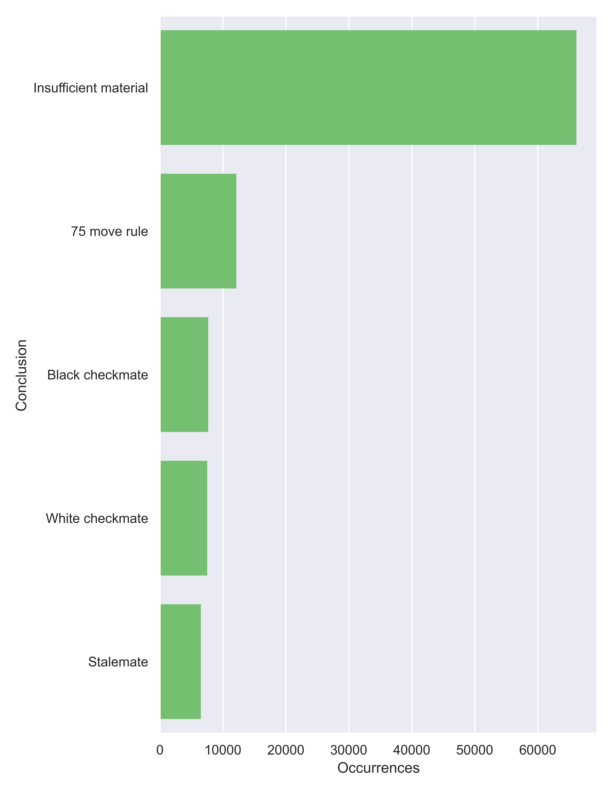

## What is this?

Just a little project I worked on for some practice and fun. 

`chess_random.py` is a script that uses the [Chess library](https://python-chess.readthedocs.io/en/latest/index.html) to play games of chess with completely random (legal) moves. It outputs counts of results of those game by conclusion (checkmate, stalemate, etc.), counts of games for number of (white) moves, and PGNs for games ending in checkmate. Those outputs are exported as `random_move_results.pickle`, `random_move_counts.pickle`, and `random_checkmates.txt`, respectively. For 100k games, it took about an hour to run.

`chess_random_viz.ipynb` is a jupyter notebook in which I do some light visualisation using the data generated from `chess_random.py`. Running its cells will output `random_move_counts.png` and `random_move_results.png`.

I'm planning on coming back to this at some point. In particular, I'd like to graph move counts *together* with conclusions - something I can't do right now with the way I collected the data. It should be simple enough to count [conclusion, move_count] pairs rather each separately. It probably would have made sense to do that to begin with, but my concern at the time was bogging down my computer with a large dict, and increasing runtime.